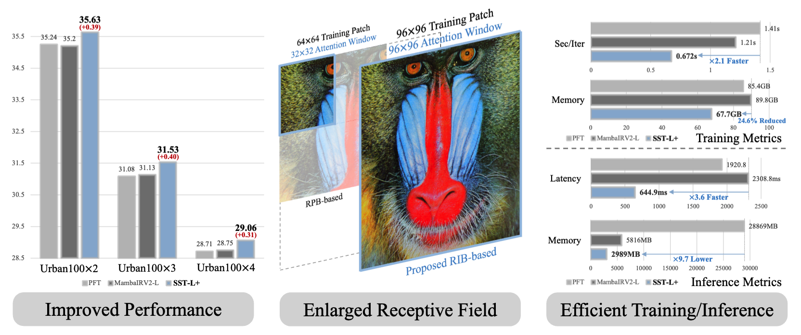
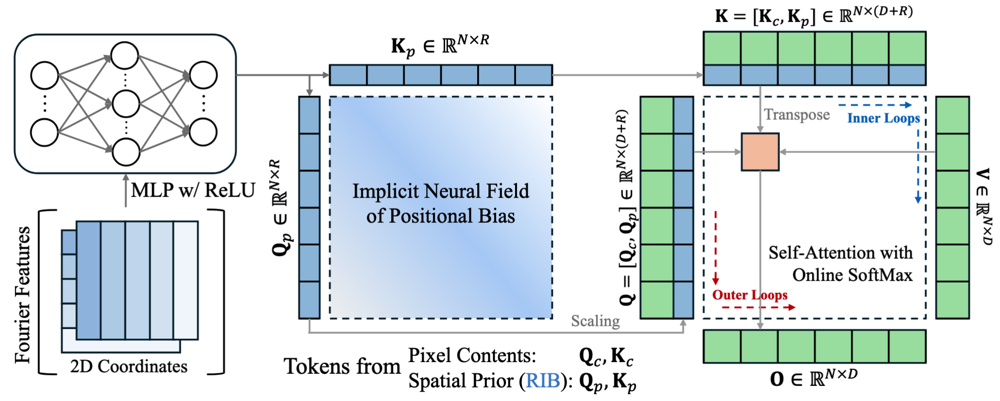

# Rank-Factorized Implicit Neural Bias: Scaling Super-Resolution Transformer with FlashAttention



by Dongheon Lee, Seokju Yun, Jaegyun Im and Youngmin Ro

## Abstract

>Recent Super-Resolution (SR) methods mainly adopt Transformers for their strong long-range modeling capability and exceptional representational capacity. 
However, most SR Transformers rely heavily on relative positional bias (RPB), which prevents them from leveraging hardware-efficient attention kernels such as FlashAttention.
This limitation imposes a prohibitive computational burden during both training and inference, severely restricting attempts to scale SR Transformers by enlarging the training patch size or the self-attention window.
Consequently, unlike other domains that actively exploit the inherent scalability of Transformers, SR Transformers remain heavily focused on effectively utilizing limited receptive fields.
In this paper, we propose Rank-factorized Implicit Neural Bias (RIB), an alternative to RPB that enables FlashAttention in SR Transformers.
Specifically, RIB approximates positional bias using low-rank implicit neural representations and concatenates them with pixel content tokens in a channel-wise manner, turning the element-wise bias addition in attention score computation into a dot-product operation.
Further, we introduce a convolutional local attention and a cyclic window strategy to fully leverage the advantages of long-range interactions enabled by RIB and FlashAttention.
We enlarge the window size up to 96×96 while jointly scaling the training patch size and the dataset size, maximizing the benefits of Transformers in the SR task.
As a result, our network achieves 35.63 dB PSNR on Urban100×2, while reducing training and inference time by 2.1 and 2.9, respectively, compared to the RPB-based SR Transformer (PFT).



## TODO
 - [ ] Supports Real-world SR Tasks

## Installation

```bash
git clone https://github.com/dslisleedh/SST.git
cd SST
conda create -n sst python=3.11
conda activate sst
pip install torch==2.9.1 torchvision==0.24.1 torchaudio==2.9.1 --index-url https://download.pytorch.org/whl/cu128
pip install -r requirements.txt
python setup.py develop
```

## Train

### Single GPU
```bash
python -m sst.train -opt $CONFIG
```

### Multi-GPUs (Local)
```bash
PYTHONPATH="./:${PYTHONPATH}" CUDA_VISIBLE_DEVICES=0,1,2,3 python -m torch.distributed.launch\
  --nproc_per_node=4 --master_port=5612 \
 sst/train.py -opt $CONFIG_PATH --launcher pytorch
```

### Multi-GPUs (SLURM)
```bash
PYTHONPATH="./:${PYTHONPATH}" GLOG_vmodule=MemcachedClient=-1 srun -p $PARTITION --mpi=pmi2 \
    --gres=$GPUS --ntasks=4 --cpus-per-task $CPUs --kill-on-bad-exit=1 \
    python -u sst/train.py -opt $CONFIG_PATHl --launcher="slurm" 
```

## Test
```bash
python -m sst.test -opt $CONFIG
```
